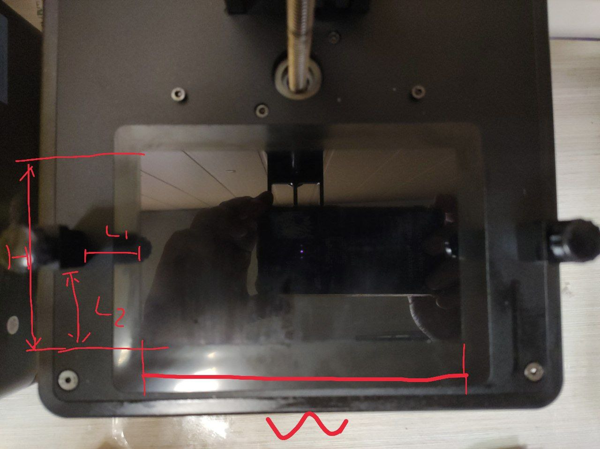
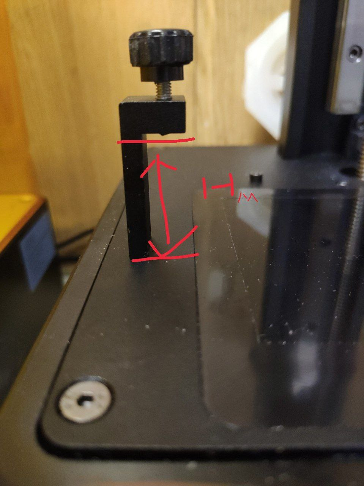

= Оснастка для фиксации заготовок на SLA принтере

Для SLA/DLP 3D принтера необходимо изготовить оснастку, которая позволит повторяемо размещать заготовку в область засветки УФ лучами с рисунками, последовательно: травления, паяльной маски, шелкографии.

== Изготовление

Основные размеры для оснасток различных SLA 3D принтеров записываются в файл `scad/dlp_printer_fixtures.scad`. Если нужная модель принтера уже находится в этом файле, сгенерировать STL можно с помощью OpenSCAD так:

[source, openscad, title=Пример генерации оснастки к принтеру ANYCUBIC PHOTON MONO 4K]
----
include <dlp_printer_fixtures.scad>

dlp_printer_fixture(ANYCUBIC_PHOTON_MONO_4K);
----

Если нужной модели нет, то её можно добавить в файл `scad/dlp_printer_fixtures.scad`, предварительно измерив соответствующие габариты и расстояния принтера.

[source, openscad, title=Пример существенных для оснастки размеров принтера]
----
//                         name,              H,     W,    L1, L2, Hm,Hf, Tf
ANYCUBIC_PHOTON_MONO_4K = ["Photon Mono 4K", 81, 132.7, 23.15, 33, 30, 4, 10];
----

* Размеры H, W, L1, L2, Hm указаны на изображениях ниже
* Hf — высота рамки оснастки, размер по оси Z над экраном
* Tf — толщина рамки оснастки — размер добавляется к осям X, Y.

Эти же размеры используются для создания модели рамки для нанесения УФ паст (фоторезиста, маски, шелкографии ит .д.) на заготовки.

== Применение

Оснастка устанавливается вместо ванночки для смолы и плотно прижимается к креплениям ванночки так, чтобы всегда занимать одно и то же место. Снятие и установка оснастки не должно приводить к изменениям в результатах засветки одинаковых заготовок текстолита.
