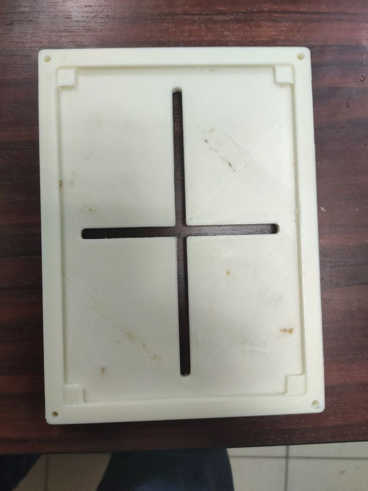
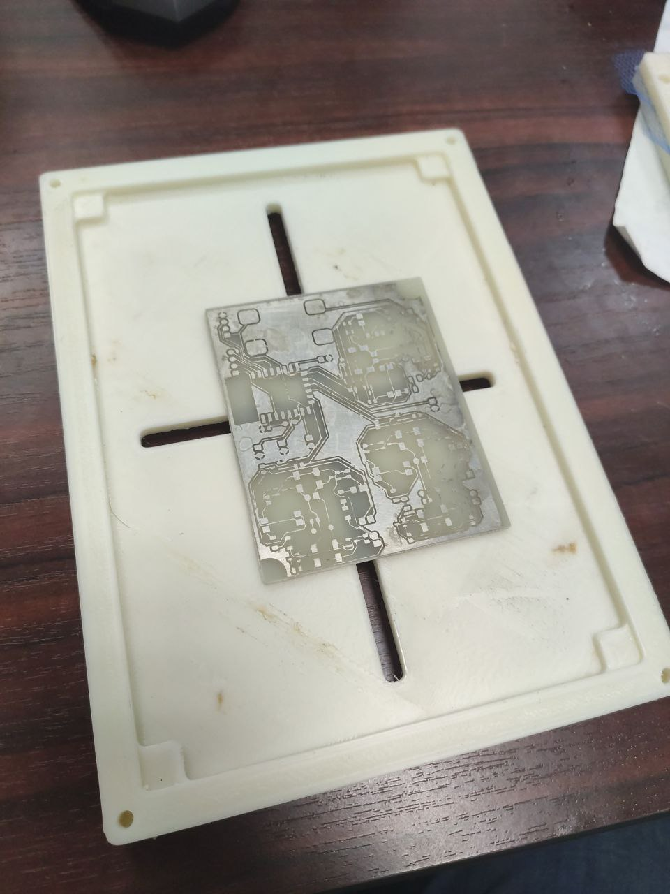
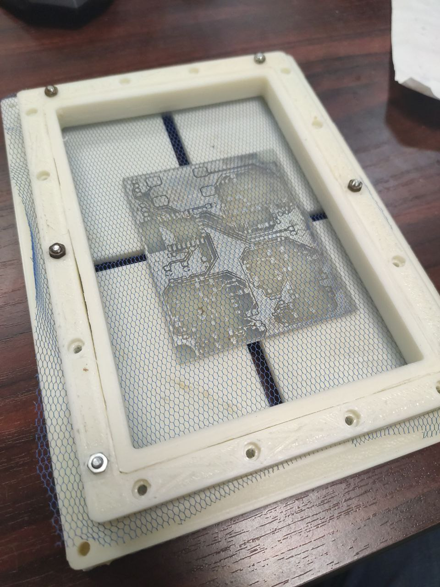

= Рамка для нанесения фотоотверждаемых паст

После того как вы сгенерировали оснастку для установки фольгированного текстолита на принтер можно так же сгенерировать рамку для нанесения фоторезиста, паяльной маски и шелкографии.

Кроме рамки для этого потребуется специальная трафаретная ткань, но если такую ткань нет возможности приобрести — сойдёт тюль. :)

[source, openscad, title=Пример генерации рамки к заготовкам для принтера ANYCUBIC PHOTON MONO 4K]
----
include <dlp_printer_fixtures.scad>
use <dlp_printer_stencil_frame.scad>

dlp_printer_stencil_frame_top(ANYCUBIC_PHOTON_MONO_4K);
----

Получившаяся рамка будет состоять из 3 деталей, 2 из которых нужно будет собрать и зафиксировать в них трафаретную ткань с помощью винтов М3, затем аналогично пяльцам растянуть ткань третьей деталью.

[.floating-block]
---
[.left]

[.left]

---

Держатель заготовки так же требует 4 винта М3 для фиксации подвижных лапок.

Ракель можно так же распечатать на 3D принтере (моделей нет) из ABS и TPU, либо использовать готовые резиновые шпатели.
